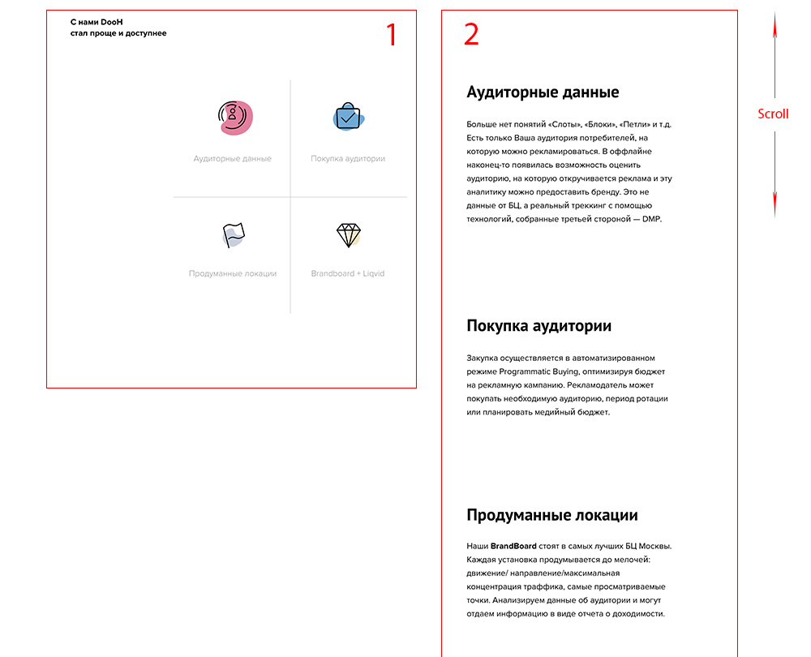
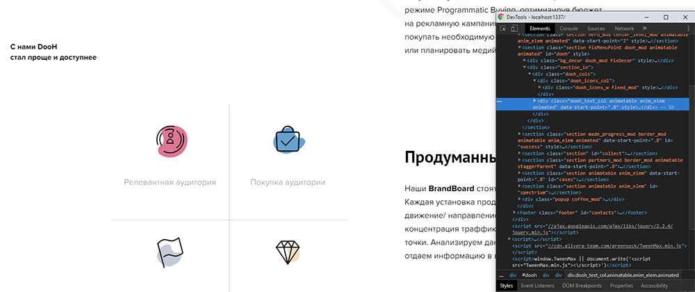
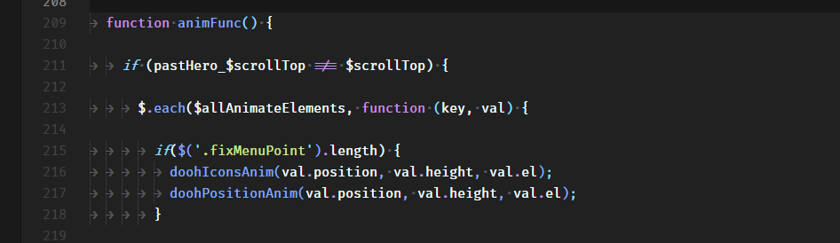

## Анимация элементов при скролле страницы средствами GSAP.
Рассмотрим создание анимации элементов при скролле страницы на примере конкретного задания.
### Что имеем
Секция, в которой размещены два блока (рис.1). Слева располагается заголовок и блок с иконками (1), справа блоки с текстом (2). Далее блоки буду обозначать соответствующими цифрами.
Нам необходимо сделать следующую анимацию:
1. При скролле страницы, когда мы достигаем нужной нам секции блок слева фиксируется и остаётся на своём месте пока мы не проскроллим эту секцию.
2. Когда нужный нам текстовый блок достигает определённой точки на экране (в нашем случае эта точка равна отступу 350px от верхней части экрана). Происходит анимация (увеличение в размерах) иконки слева, которая соответствует этому текстовому блоку.
3. Анимация должна работать при скролле как вниз страницы, так и в обратном направлении.



### Что используем
Для реализации данной анимации мы будем использовать [GSAP](https://greensock.com/ "Перейти на сайт") - JavaScript библиотеку для создания высокопроизводительной анимации.

### Приступим к реализации
#### 1.HTML
Тут ничего особенного. Секция у нас разделена на два блока, с заданной шириной. В блок слева помещаем "блок 1", и справа у нас "блок 2" (рис.2)



#### 2.CSS
Блок слева у нас имеет ``position: relative;``, а вложенный "блок 1"
```
position: absolute;
top: 0;
height: calc(100vh - 10rem);
```
>Высоту мы вычисляем из расчёта 100% высоты экрана минус верхний отступ нашей секции, который равен 10rem.

Также добавляем необходимые стиля для классов, которые будут задавать позиционирование для нашего "блока 1":

```
.fixed_mod {
		position: fixed;
		top: 10rem;
}

.bottom_mod {
		position: absolute;
		top: auto;
		bottom: -10rem;
}
```
Анимация иконки будет обычным увеличением через scale, просто будем добавлять нужный класс.

```
.scale_mod {
		transform: scale(1.2);
}
```

#### 3.JavaScript
У нас подключены следующие библиотеки:
1. [Jquery](https://jquery.com/ "Перейти на сайт")
2. [TweenMax](https://greensock.com/docs/NPMUsage "Перейти на сайт")
3. [Наш небольшой скрипт](https://github.com/glivera-team/glivera-team-template/tree/master/helpers/components/animatable "Открыть на GitHub"), который нам помогает при работе с анимацией привязанной к скроллу страницы. Полностью его работу описывать не буду, так-как мы затронем его лишь малую часть. Мы это сделаем отдельной статьёй. Если коротко, он собирает массив данных, к примеру таких как: высота нужного нам блока, его координаты относительно начала страницы и т.д. Важная особенность, что используется [TweenMax.ticker](https://greensock.com/docs/TweenMax/static.ticker) облегчающий нам работу с [requestAnimationFrame](https://developer.mozilla.org/ru/docs/DOM/window.requestAnimationFrame).

И так! Ближе к делу :). Используя скрипт мы:
- Нашли нужную нам секцию
- узнали её высоту ``.outerHeight();``
- координаты относительно начала страницы ``.offset().top;``

Теперь нам нужно узнать позицию скролла относительно начала страницы.
В глобальной зоне видимости создаём переменную ``var $scrollTop = 0;`` и вешаем на обработчики событий ``window.onload`` и ``window.onscroll`` её перезапись ``$scrollTop = $(window).scrollTop();``

Так же в глобальной зоне видимости добавим два пустых массива для наших иконок и текстовых блоков.
```
var doohIconsArray = [],
	doohTextArray = [];
```

Далее создаём функцию, которая соберёт нам данные, запишет в массивы. Вызывать её будем на ``window.onload``.

```
function doohArrayInit() {
	if ($doohIconsParent.length) {
				//Ищем наши иконки и записываем их в массив
		$('.dooh_icon_wrap').each(function () {
			var icon = $(this);
			var iconObj = {
				'icon': icon
			};
			doohIconsArray.push(iconObj);
		});

				//Ищем наши текстовые блоки, узнаем их координаты относительно начала страницы и записываем параметры в массив
				$('.dooh_text_item', $doohTextList).each(function (i, el) {
						var el = $(this);
						var itemPos = el.offset().top;
						var textObj = {
								'item': el,
								'pos': itemPos
						};
						doohTextArray.push(textObj);
				});
		}
}
```
Ещё один момент! Согласно ТЗ, наши текстовые блоки на экранах меньше 1024 становятся слайдером и иконки анимируются в соответствии текущему слайду. Поэтому нужно не забыть после изменения размеров страницы ``window.onresize`` обновлять текстовый массив и все наши данные из скрипта, чтобы все работало как нужно.
```
	if (doohTextArray) {
		$.each(doohTextArray, function (key, value) {
			value.pos = value.item.offset().top;
			value.height = value.item.outerHeight();
		});
	}

	if ($allAnimateElements) {
		$.each($allAnimateElements, function (key, value) {
			value.position = value.el.offset().top;
			value.height = value.el.hasClass("parallaxElement") ? windowHeight : value.el.outerHeight();
		});
	}
```
Кажись ничего не забыл :D. Идём дальше...
## Анимация
Создаём наши две функции. Вызовем мы их в нашем скрипте с передачей необходимых аргументов.



Добавляем в глобальную зону видимости флаги, которые нам помогут запускать анимацию только в нужном для нас месте, и наш отступ от верхней точки экрана для текстового блока в 350px.

```
var textPos1 = false,
	textPos2 = false,
	textPos3 = false,
	textPos4 = false,
	textOffsetTop = 350;
```

### Анимация иконок
Создаём функцию, передаём нужные нам аргументы и начинаем по порядку добавлять туда наши условия.
```
function doohIconsAnim(position, height, el) {}
```
Главное наше условие - это ширина экрана. Выше я упомянул про мобильную версию. Также мы проверяем нужную нам секцию по классу.
ё
```
if (windowWidth > 1023 && el.hasClass('fixMenuPoint') {}
```
**Разбор кода на примере анимации 1й иконки**
Запишем условие, которое проверит, что позиция скролла ``$scrollTop`` + отступ от верхней точки экрана ``textOffsetTop`` больше или равен позиции первого блока относительно начала страницы ``doohTextArray[0].pos`` и позиция скролла ``$scrollTop`` + отступ от верхней точки экрана меньше позиции второго блока относительно начала страницы. Также мы проверим, что анимация первой иконки у нас еще не запущена ``!textPos1``. Если условия соблюдены, то мы переходим к анимации 1й иконки, добавляя ей нужный класс ``scale_mod`` используя GSAP ``TweenMax.set(doohIconsArray[0].icon, {className: '+=scale_mod'});`` . Также мы отмечаем, что анимация 1й иконки у нас отработала ``textPos1 = true;``.
В альтернативной ветке мы запишем условие для возврата иконки в исходное состояние если у нас анимация отработала, но мы начали скроллить страницу вверх. В таком случае мы проверяем, что позиция скролла ``$scrollTop`` + отступ от верхней точки экрана ``textOffsetTop`` меньше позиции первого блока относительно начала страницы ``doohTextArray[0].pos`` и анимация первой иконки уже выполнялась ``textPos1``. Если условия выполнены мы убираем ``scale_mod`` у иконки и ставим флаг в исходное положение ``textPos1 = false;``.

Весь код анимации 1й иконки:

```
	if ($scrollTop + textOffsetTop >= doohTextArray[0].pos && $scrollTop + textOffsetTop < doohTextArray[1].pos && !textPos1) {
			textPos1 = true;
			TweenMax.set(doohIconsArray[0].icon, {className: '+=scale_mod'});
		} else {
			if ($scrollTop + textOffsetTop < doohTextArray[0].pos && textPos1) {
				textPos1 = false;
				TweenMax.set(doohIconsArray[0].icon, {className: '-=scale_mod'});
			}
		}
```

Все последующие условия схожи, отличие лишь в области действия. Ниже приведён весь код анимации.

```
function doohIconsAnim(position, height, el) {
	if (windowWidth > 1023 && el.hasClass('fixMenuPoint')) {
		if ($scrollTop + textOffsetTop >= doohTextArray[0].pos && $scrollTop + textOffsetTop < doohTextArray[1].pos && !textPos1) {
			textPos1 = true;
			TweenMax.set(doohIconsArray[0].icon, {className: '+=scale_mod'});
		} else {
			if ($scrollTop + textOffsetTop < doohTextArray[0].pos && textPos1) {
				textPos1 = false;
				TweenMax.set(doohIconsArray[0].icon, {className: '-=scale_mod'});
			}
		}

		if ($scrollTop >= position) {
			if ($scrollTop + textOffsetTop >= doohTextArray[1].pos && $scrollTop + textOffsetTop < doohTextArray[2].pos && !textPos2) {
				textPos2 = true;
				textPos1 = false;
				TweenMax.set('.dooh_icon_wrap.scale_mod', {className: '-=scale_mod'});
				TweenMax.set(doohIconsArray[1].icon, {className: '+=scale_mod'});
			} else if ($scrollTop + textOffsetTop >= doohTextArray[2].pos && $scrollTop + textOffsetTop < doohTextArray[3].pos && !textPos3) {
				textPos3 = true;
				TweenMax.set('.dooh_icon_wrap.scale_mod', {className: '-=scale_mod'});
				TweenMax.set(doohIconsArray[2].icon, {className: '+=scale_mod'});
			} else if ($scrollTop + textOffsetTop >= doohTextArray[3].pos && !textPos4) {
				textPos4 = true;
				TweenMax.set('.dooh_icon_wrap.scale_mod', {className: '-=scale_mod'});
				TweenMax.set(doohIconsArray[3].icon, {className: '+=scale_mod'});
			} else {
				if ($scrollTop + textOffsetTop < doohTextArray[1].pos && $scrollTop + textOffsetTop >= doohTextArray[0].pos && textPos2) {
					textPos2 = false;
					TweenMax.set('.dooh_icon_wrap.scale_mod', {className: '-=scale_mod'});
					TweenMax.set(doohIconsArray[0].icon, {className: '+=scale_mod'});
				} else if ($scrollTop + textOffsetTop < doohTextArray[2].pos && $scrollTop + textOffsetTop >= doohTextArray[1].pos && textPos3) {
					textPos3 = false;
					TweenMax.set('.dooh_icon_wrap.scale_mod', {className: '-=scale_mod'});
					TweenMax.set(doohIconsArray[1].icon, {className: '+=scale_mod'});
				} else if ($scrollTop + textOffsetTop < doohTextArray[3].pos && $scrollTop + textOffsetTop >= doohTextArray[2].pos && textPos4) {
					textPos4 = false;
					TweenMax.set('.dooh_icon_wrap.scale_mod', {className: '-=scale_mod'});
					TweenMax.set(doohIconsArray[2].icon, {className: '+=scale_mod'});
				}
			}
		}
	}
}
```
### Фиксация блока слева
По условиям нашего ТЗ "блок 1" должен фиксироваться пока мы проходим нашу секцию.

Добавим флаги в глобальную зону видимости, они нам также как и в работе с иконками помогут четко контролировать, чтобы анимация запускалась строго в отведённый для неё момент.

```
var doohFixed = false,
		doohBottom = false;
```

В нашу функцию мы передаём такие аргументы:
- ``el`` - наша секция
- ``position`` - позиция секции относительно начала страницы.
- ``height`` - высота секции

В начале мы проверяем что ширина экрана у нас больше 1023px и наша секция имеет соответствующий класс. Далее у нас есть три условия - три позиции при которых наш "блок 1" получает или теряет нужный нам класс. Добавлять классы мы также будем при помощи GSAP.

**Условие 1:**
Если позиция скролла больше позиции секции относительно начала страницы ``$scrollTop > position``. Т.е мы находимся в начале нашей секции. Также мы проверим, что фиксации блока еще не было ``!doohFixed``. Если условия соблюдены мы добавляем нашему блоку нужный нам ``position: fixed;`` для его фиксации ``TweenMax.set($doohIconsParent, {className: '+=fixed_mod'});`` и отмечаем, что фиксация блока произошла ``doohFixed = true;``.
Там же добавим условие, когда мы были внизу секции и возвращаемся обратно, фиксируя повторно блок ``$scrollTop + windowHeight < position + height``. В этом случае мы должны забрать ``position: absolute;``  у нашего блока ``TweenMax.set($doohIconsParent, {className: '-=bottom_mod'});`` и поставить нужное значение нашему флагу ``doohBottom = false;``

**Условие 2:**
Когда мы доходим до конца секции или находимся под ней "блок 1" у нас больше не фиксируется. Проверим это так: позиция скролла + высота экрана у нас больше или равна позиции секции + её высоте ``$scrollTop + windowHeight >= position + height``. Не забываем проверить, что мы еще не выполняли эту анимацию ``!doohBottom``. Если условия соблюдены мы убираем ``position: fixed;`` и добавляем ``position: absolute;``, отмечаем что эта анимация отработала ``doohBottom = true;`` и отмечаем, что блок у нас больше не фиксированный ``doohFixed = false;``.

**Условие 3:**
Это условие у нас должно отрабатывать когда наш блок фиксирован и мы скроллим страницу вверх, т.е возвращаемся обратно в исходное положение. Укажем необходимое условие: позиция скролла у нас меньше или равна позиции секции и наш блок иконок в данный момент был фиксирован ``$scrollTop <= position && doohFixed``. Если правило соблюдено мы убираем фиксацию нашего блока ``TweenMax.set($doohIconsParent, {className: '-=fixed_mod'});`` и отмечаем, что блок у нас больше не фиксированный ``doohFixed = false;``.

Весь код фиксации блока:
```
function doohPositionAnim(position, height, el) {
	if (windowWidth > 1023 && el.hasClass('fixMenuPoint')) {
		if ($scrollTop > position && $scrollTop + windowHeight < position + height && !doohFixed) {
			TweenMax.set($doohIconsParent, {className: '+=fixed_mod'});
			TweenMax.set($doohIconsParent, {className: '-=bottom_mod'});
			doohFixed = true;
			doohBottom = false;
		} else if ($scrollTop + windowHeight >= position + height && !doohBottom) {
			doohBottom = true;
			doohFixed = false;
			TweenMax.set($doohIconsParent, {className: '-=fixed_mod'});
			TweenMax.set($doohIconsParent, {className: '+=bottom_mod'});
		} else if ( $scrollTop <= position && doohFixed) {
			doohFixed = false;
			TweenMax.set($doohIconsParent, {className: '-=fixed_mod'});
		}
	}
}
```
На этом всё. Комментарии и критика приветствуется :)